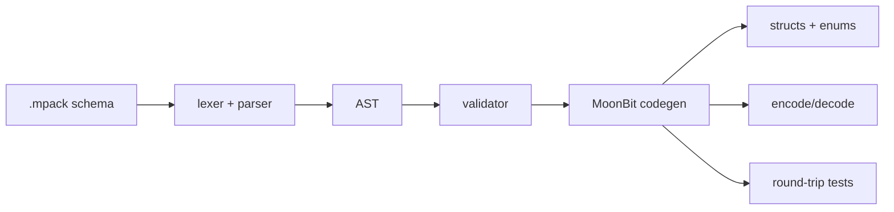

# MoonPack

MoonPack is a MoonBit-native schema-first binary serialization toolkit.

It uses a compact tag-based wire format inspired by protobuf, but keeps the
schema language intentionally small so MoonBit projects can generate predictable
types and encoders without pulling in a large compatibility surface.

## Highlights

- MoonBit-native schema parser, validator, code generator, and CLI.
- Compact tag-based binary wire format with unknown-field skipping.
- Generated MoonBit structs, enums, defaults, sample fixtures, encode/decode,
  equality helpers, enum mappings, and value round-trip tests.
- Supports scalar fields, optional fields, `List[T]`, enums, nested messages,
  reserved field/tag numbers, and reserved ranges such as `reserved 10..20`.
- Includes schema compatibility checks for safe version evolution.
- Designed as reusable infrastructure for tools, games, caches, and data
  exchange in the MoonBit ecosystem.

## Why Not Just Protobuf

MoonPack borrows the proven `field_number + wire_type` idea from protobuf, but
does not try to be protoc-compatible. The goal is a smaller MoonBit-first
library that is easier to inspect, extend, and use in contest-sized projects.

| Area | MoonPack | Protobuf |
| --- | --- | --- |
| Schema | Small `.mpack` language | Full `.proto` language |
| Codegen | MoonBit-only MVP | Multi-language ecosystem |
| Wire format | Tag-based, protobuf-inspired | Protobuf-compatible |
| Scope | 4k-10k LOC target | Large mature ecosystem |
| Goal | MoonBit ecosystem building block | Cross-language standard |

## Use Cases

- Game save files and deterministic simulation snapshots.
- CLI/toolchain cache records.
- Local configuration or project metadata.
- Network message definitions for small MoonBit services.
- Test fixtures that need compact binary round-trips.

## Status

This repository contains a working MVP. It can parse `.mpack` schemas, validate
them, generate MoonBit code, and run generated round-trip tests.

## Example Schema

```text
package demo.auth

message User {
  1: id Int64
  2: name String
  3: email String?
  4: roles List[String]
  5: status UserStatus
}

enum UserStatus {
  0: Unknown
  1: Active
  2: Disabled
}
```

## CLI

```text
moonpack check examples/auth/auth.mpack
moonpack compat examples/compat/savegame_v1.mpack examples/compat/savegame_v2.mpack
moonpack gen examples/auth/auth.mpack -o generated
```

From this workspace:

```powershell
$env:PATH='D:\moonbit\.moonhome\bin;' + $env:PATH
$env:MOON_HOME='D:\moonbit\.moonhome'
moon run src/cli -- check examples/auth/auth.mpack
moon run src/cli -- compat examples/compat/savegame_v1.mpack examples/compat/savegame_v2.mpack
moon run src/cli -- gen examples/savegame/savegame.mpack -o generated
moon check
moon test
```

`gen` writes:

- `generated/demo/savegame/moon.pkg`
- `generated/demo/savegame/vec2.mbt`
- `generated/demo/savegame/vec2_test.mbt`
- `generated/demo/savegame/inventory_item.mbt`
- `generated/demo/savegame/inventory_item_test.mbt`
- `generated/demo/savegame/save_game.mbt`
- `generated/demo/savegame/save_game_test.mbt`

Example output:

```text
ok: demo.auth
ok: compatible
generated: generated/demo/savegame
Total tests: 14, passed: 14, failed: 0.
error: examples/invalid/reserved.mpack:5:3: field number 1 is reserved in message User
error: compat failed: message Save removed field 2 without reserving it
```

## Flow



## Packages

- `src/core`: wire format, varint, reader, writer, errors.
- `src/schema`: schema tokens, lexer, AST, parser, validator.
- `src/codegen`: MoonBit source emitter.
- `src/cli`: command entry point.

## MVP Scope

- Primitive types: `Bool`, `Int`, `Int64`, `Double`, `String`, `Bytes`.
- Compound types: `message`, `enum`, `List[T]`, optional `T?`.
- Wire types: varint, fixed64, length-delimited.
- Unknown field skipping for forward compatibility.
- Schema parser and validation.
- MoonBit source generation for default values, enum mappings, encode/decode,
- equality helpers, and value round-trip tests.
- Compatibility checks between old and new schema files.

## Current Verification

- `moon check`: passing.
- `moon test`: passing with 14 tests, including generated value round-trip tests.

The generated MVP supports scalar fields, optional fields, repeated fields via
`List[T]`, enums, nested messages, and Double via fixed64.

## Demo

```text
package demo.savegame

message Vec2 {
  1: x Double
  2: y Double
}

message SaveGame {
  reserved 6
  reserved 10..20
  1: player_id String
  2: level Int
  3: position Vec2
  4: inventory List[InventoryItem]
  5: note String?
}
```

Generated API names are stable snake_case:

```text
default_save_game()
sample_save_game()
equal_save_game(lhs, rhs)
encode_save_game(value)
decode_save_game(bytes)
```

## Repository Layout

```text
D:\moonbit\
  plan.md
  README.md
  moon.mod.json
  docs\
  examples\
  src\
    core\
    schema\
    codegen\
    cli\
  tests\
```

## Competition Value

MoonPack targets a reusable infrastructure gap in the MoonBit ecosystem:
schema-driven binary data exchange. A finished version can be used by command
line tools, game save files, local caches, RPC message definitions, and test
fixtures.
